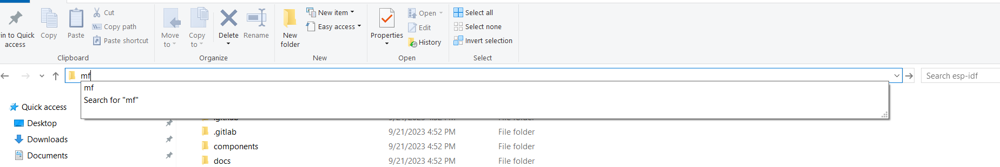
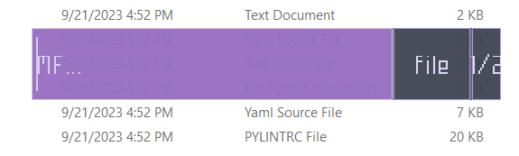
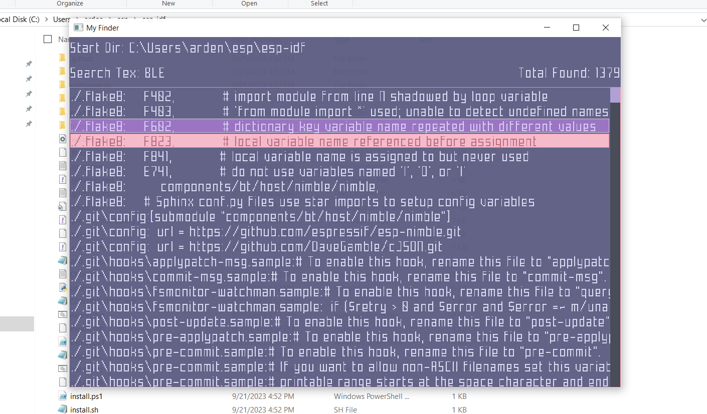

# My Finder 0.1

A GUI tool to search texts/files in the directory you open it from and all its sub directories recursively for windows. I started this
project as I was having trouble looking for certain things in esp32 examples/components directories while working with coded phy ble.
Generally, I would go on the internet and search for an app and I am sure there exists one that does a good job at it (at least better than
windows); but, this time I decided to do this one myself. I am not sure if I achieved what I set out for but I am a perfectionist and I should
not hold myself to my standard if I want to remain sane.

# Info

Initially I wanted to name this app mom cause you know mom finds everything you need. But I did not like the idea of people using the app
for searching their porn collection or even worse their anime collection so I changed it to mf (my finder :wink: ). Also, I do undertand that nobody might ever use it and thats fine as well. The app uses raylib and raygui. I have modified the raygui file to include custom functions. I am pretty sure this must be legal, if it is not do let me know. I have attached a build.sh file that can be used to build your own version of the app and also an executable that will run right away.

# Usage

 - Add the mf.exe file to your path.
 - Then open the directory you want to start the search.
 - Go to the taskbar? and on the place of the path type mf 
 
 

 - Then a window will appear where you type the text or file name you want search. Make sure you change the selection accordingly.

 

 - Finally, the window with the results of your search will appear. You can look into the search results. Select the file one you want to open.
 And press enter to open the file. Keep in the mind that the file will open or execute based on the default type set on it.

 

 # Ending

I do plan on making few changes and upates to this app but cannot vouch for its usability as it was a just for fun project and I have not put
much thought either into its design or its execution. However, I will appreciate any suggestions or discussions.